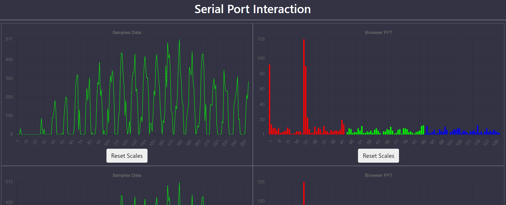

## Описание

**Целью создания данного проекта является разработка удобной, интерактивной среды для взаимодействия с микроконтроллерами по последовательному порту.**


Для взаимодействия с последовательным портом будет использоваться серверная сторона на языке программирования Python с применением асинхронного фреймворком **FastAPI** и асинхронной библиотекой **pyserial-asyncio**. Клиентская сторона будет подключаться к серверной стороне посредством протокола **WebSocket**.

Cервер будет отдавать главную страницу и статические файлы. HTML оформляется с применением инструментария **Bootstrap**.

Клиентская сторона будет использовать язык программирования **JavaScript** и библиотеку **Chart.js** для вывода графиков. Посредством редактирования файла `frontend/static/main.js` осуществляется конфигурирование вывода получаемых данных. Данные должны отправляться в формате **JSON** со структурой `{"dataType": "someType", data: [1,2,3, ...]}`. В данной структуре на данный момент можно изменять значения типа данных _dataType_ и сами данные _data_.

_**!!!** В первой релизации, **ПО будет позволять только выводить интерактивные графики**, которые нужно предварительно сконфигурировать посредством языка JS, но в перспективе можно вовсе избавить пользователя от конфигурации и производить настройку и управление только в браузере._

При получении данных с сервера, определяется их тип и производится поиск графиков, которые подписаны на получение этих данных. Если таковые имеются, данные в них заменяются на новые и производится перерисовка соответствующих графиков.

---
## Особенности
* **Интерактивная разработка кода.** При внесении изменений в файлы с расширениями **py**, **html**, **js**, **css**, сервер перезагружается, разрывая все вебскет соединения. Клиент видит разрыв, ожидает перезагрузку и перезагружает страницу браузера.
* **Высокая скорость работы.** Система должна работать быстро в обычных условиях, замедление скорости могут возникнуть из-за низкой скорости последовательного порта или огромного объема данных, которые может быть трудно отрисовавать плагину `Chart.js`.
* **Настройка сервера посредством конфиг файла.** Конфиг файла создается после первого запуска сервера, в нем можно поменять порт сервера, пути до файла главной страницы и папки статических файлов. Таким образом можно вообще не использовать предоставляемую клиенскую сторону, а разработать её самостоятельно. Также в этом файле можно изменять скорость последовательного порта и адрес порт, который изначально закоментирован в общем-то и не обязательно указывать. В случае, когда адрес порта не передан, сервер сам проверяет доступные порты в системе и пытается подключиться к каждому из них. При отключении устройства последолвательного порта, сервер ожидает его подключения и вновь подключается к прослушиванию.
* **Реализовано два типа: линейный и бар.** Так, первый уже можно использовать для вывода значений звуковых семплов, а второй для вывода амплитудно-частотных рядов после преобразования.
* **Разработка своих типов графиков.** С помощью наследования и перегрузки методов можно создать свой собственный тип графика, который будет иным образом обрабатывать и выводить данные на график.
* **Масштаб графиков.** Графики автоматически масштабируются в сторону увеличения данных. Так, если сначала передавать данные, разница которых была 200, то он будет отображать их на всю длину, если передать графики с разницей 400, он растянется под новый диапазон, но если разница снова уменьшится, график не будет понижать масштабирование. Масштаб можно сбросить посредством нажатия на кнопку _Reset Scale_.
* **Автоматическое скрытие неактвных графиков.** Если график подписан на обновление данных, а данные не приходили более 200 мс, график скроется и перестанет отображаться. Возобновление передачи ему данных вновь отобразит график в автоматическом режиме.
---
## Пример конфигурационного файла `main.js`


```
import {ReloadWebsocket, SerialWebSocket} from './dist/websockets.js'
import {ChartManager} from './dist/chart.manager.js'
import {DefaultChart, FourierSeriesChart} from './dist/chartsLibrary.js'

const serialWebSocket = new SerialWebSocket('ws://localhost/serial')
const chartManager = new ChartManager(serialWebSocket)

import {FFT} from './fft.js'


class SamplesChart extends DefaultChart {}

class BrowserFFTChart extends FourierSeriesChart {
  convertData(labels, values) {
    let fftOut = FFT(values)
    return {labels: labels.slice(0, labels.length/2), values: fftOut}
  }
}

function main(event) {
  chartManager.createChart(SamplesChart, 'samplesData', 'Samples')
  chartManager.createChart(BrowserFFTChart, 'samplesData', 'Browser FFT')
  chartManager.createChart(FourierSeriesChart, 'fhtData', 'Arduino FHT')

  const samplesChart = chartManager.createChart(SamplesChart, null, 'Samples Data')
  samplesChart.updateData(values)
  const browserFFTChart = chartManager.createChart(BrowserFFTChart, null, 'Browser FFT')
  browserFFTChart.updateData(values)
}

main()
```

---


## Установка

**Необходимо создать виртуальное окружение Python, активировать его и установить зависимые пакеты посредством консоли или терминала.**  

Создание виртуального окружения:
```console
python3 venv venv
```
Если используется OS Windows активация будет происходить по команде:
```console
venv\Scripts\activate
```
Для OS Linux команда соответствует:
```console
source venv/bin/activate
```
Установка пакетов:
```console
pip install -r requirements.txt
```
---

## Запуск

**Запуск сервера осуществляется по команде:**
```console
python start.py
```
**Примечание:** _предварительно необходимо активировать виртуальное окружение!!!_

---

## Подключение
**Если сервер запущен на локальном компьютере подключение к клиенской части осуществляется через браузер по адресу:**
URL: [**localhost**](http://localhost) или [**127.0.0.1**](http://127.0.0.1)


---

## Лицензия

Этот проект распространяется на условиях лицензии MIT.
